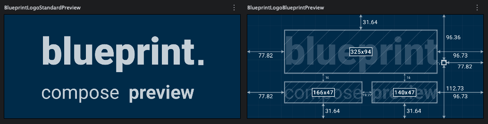
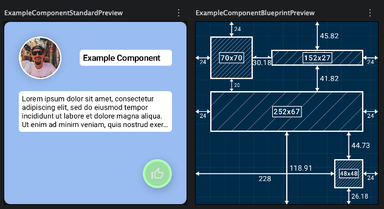

# Blueprint Preview

<p align="center">
  
</p>

## The goods

Blueprint Preview is a dev tool for Jetpack Compose that shows you a "blueprint" overlay of your composables in the Android Studio Preview panel. It passively measures the components in your layout and renders dimensions and spacing just like an architectural blueprint.

```kotlin
dependencies {
    // Android
    debugImplementation("uk.co.gusward:blueprint-compose-preview:1.0.1")
    // Optional
    releaseImplementation("uk.co.gusward:blueprint-compose-preview-no-op:1.0.1")
    
    // Multiplatform
    implementation("uk.co.gusward:blueprint-compose-preview-multiplatform:1.0.1")
}
```

The no-op release implementation is optional, it just stubs out the blueprintId modifier and BlueprintPreview to prevent logic landing in app builds.

```kotlin
@Preview
@Composable
fun MyComponentPreview() {
    BlueprintPreview { // <-- that's all!
        MyComponent()
    }
}
```

## The ramble

Hey!

Thought it would be nice to add some quick background on the roots of this little project.

I started the idea a couple years ago, and wrote all of the blueprint measurement and rendering logic by hand before LLM agents became part of my daily dev work.

Originally it worked by the user / dev wrapping every component with a `BlueprintItem {}`, which allowed the grid to easily find and render it. This worked and it looked great! But I knew the extra dev friction would make it annoying to use. I also knew the tree parsing logic to make it passive would take a while to perfect, and to be honest it sounded boring, so I parked it.

Recently with the help of Gemini I revived the project, enabling me to very quickly add the dense tree parsing logic to make the blueprint a completely passive one-liner.

So while the majority of the project was hand made, this final push has been massively boosted by AI, and completed in just a couple of days 🚀

Hope you find it useful! (the rest of this readme was written by AI haha)

\- Gus

## The rest

<p align="center">
  
</p>

## Features

- **📏 Passive Measurement**: No changes required to your existing production code.
- **🗺️ Visual Overlay**: See the exact pixel (or DP) dimensions of your widgets.
- **🎯 Precision Alignment**: View spacing between components and parent boundaries.
- **🏷️ Smart Labeling**: Automatically extracts labels from `Text`, `ContentDescription`, or `testTag`.
- **🔌 Easy Integration**: Just wrap your existing `@Preview` content.
- **🎨 Configurable**: Adjust transparency and background grid settings.

## Installation

### Android

Add the dependency to your `build.gradle.kts` file:

```kotlin
dependencies {
    debugImplementation("uk.co.gusward:blueprint-compose-preview:1.0.1")
    releaseImplementation("uk.co.gusward:blueprint-compose-preview-no-op:1.0.1")
}
```

*Note: It is recommended to use `debugImplementation` as this is a development-only tool.*

### Compose Multiplatform

Blueprint Preview also supports Compose Multiplatform projects (Android, Desktop, and iOS).

Because Kotlin Multiplatform doesn't have a direct equivalent to `debugImplementation` for all targets in `commonMain`, you can configure it based on a custom gradle property (e.g. `isReleaseBuild`) or apply it directly in your platform-specific source sets.

```kotlin
kotlin {
    sourceSets {
        commonMain.dependencies {
            if (project.hasProperty("isReleaseBuild")) {
                implementation("uk.co.gusward:blueprint-compose-preview-multiplatform-no-op:1.0.1")
            } else {
                implementation("uk.co.gusward:blueprint-compose-preview-multiplatform:1.0.1")
            }
        }
    }
}
```

## Usage

Simply wrap your Composable in a `BlueprintPreview` block inside your `@Preview` function:

```kotlin
@Preview
@Composable
fun MyComponentPreview() {
    BlueprintPreview {
        MyComponent()
    }
}
```

### Explicit Naming with `blueprintId`

By default, the library tries to identify components using their text or content descriptions. For more complex layouts or to give a specific name to a container, you can use the `blueprintId` modifier:

```kotlin
@Composable
fun MyComplexLayout() {
    Column(modifier = Modifier.blueprintId("MainContainer")) {
        // ...
    }
}
```

### Configuration Options

The `BlueprintPreview` composable accepts parameters to tune the visual appearance:

| Parameter | Type | Default | Description |
| :--- | :--- | :--- | :--- |
| `backgroundAlpha` | `Float` | `1.0f` | Transparency of the blueprint grid and labels. |
| `contentAlpha` | `Float` | `1.0f` | Transparency of your actual content underneath the blueprint. |
| `showInternalItems` | `Boolean` | `true` | When `false`, hides nested blueprint items, showing only the top-level containers/widgets. |

Example with filtered internal items:

```kotlin
@Preview
@Composable
fun SimplePreview() {
    BlueprintPreview(
        showInternalItems = false
    ) {
        MyComplexComponent()
    }
}
```

## How it Works

Blueprint Preview works by passively traversing the **Compose Semantics Tree** to identify and measure layout nodes. Unlike standard inspection tools, it uses a unique "visual identity" logic to determine which bounds to render:

- **Interactive Bounds**: For interactive components like `Button`, `Switch`, and `Checkbox`, the library uses **inner layout coordinates**. This allows it to strip away the implicit 48dp minimum touch targets that Jetpack Compose adds, showing you the actual visible size of the widget.
- **Visual Bounds**: For non-interactive components like `Text`, `Image`, or custom containers, the library uses **outer layout coordinates**. This ensures that modifiers like `Modifier.background()` or `Modifier.padding()` are correctly captured as part of the component's visual footprint.
- **Passive Discovery**: It automatically extracts labels from your `Text` content, `ContentDescription`, or `testTag` properties. No manual tagging is required for most standard layouts.
- **IDE Resilience**: It includes a "Survivor Cache" that anchors measured data to the Compose composite key, ensuring the blueprint doesn't disappear during Android Studio's frequent `Layoutlib` re-composition wipes or zoom operations.

---

<p align="center">
  Made with ❤️ for the Android Community
</p>
